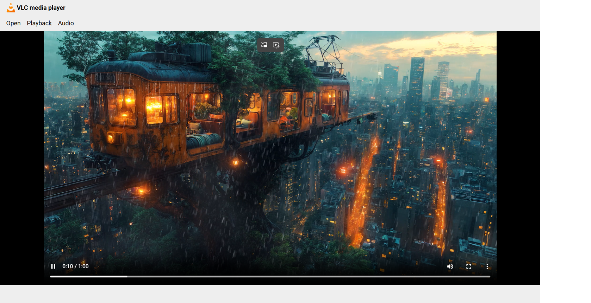

# VLC Media Player Clone

A VLC Media Player clone built using HTML, CSS, and JavaScript.

## Screenshot

## Features

* Open and play local video files
* Drag and drop video upload
* Video file validation
* Playback speed controls
* Volume controls
* Toast notifications for speed and volume changes
* Built-in video controls

## Technologies Used

* HTML5
* CSS3
* JavaScript (Vanilla JS)

## How to Run

1. Clone the repository
2. Open `index.html` in your browser
3. Click **Open** to select a video file or drag and drop a video into the player

## What I Learned

* DOM manipulation
* Event handling
* HTML5 Video API
* Drag and drop functionality
* File handling in JavaScript
* Git and GitHub workflow
